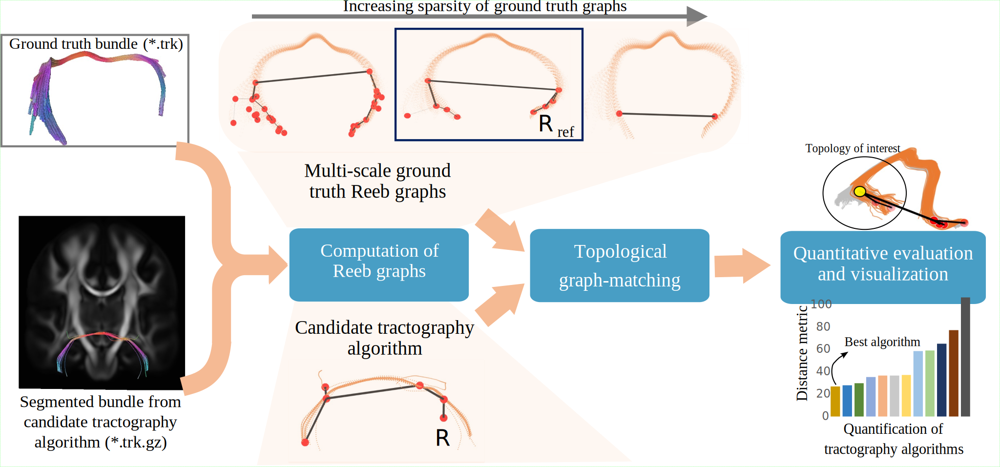

# ReTrace

This repository contains the code for the implementation of ReTrace, a tractography evaluation and validation method. 



This figure illustrates the general pipeline of our project.

## About

ReTrace is designed as a tool for evaluation and validation of tractography methods to provide topological insight and to guide future development in this field. 

## Publication

The method is presented in our paper submitted to the Conference on Diffusion MRI (CDMRI) 2023. The pre-print version of the paper is now available and can be accessed [here](https://biorxiv.org/cgi/content/short/2023.07.03.547451v1).


## Usage

Here's how to get started:

1. Navigate to the project directory.

```bash
cd /path/to/project
```

2. The project primarily consists of the following files:

    - `Visualization_SCP_left_ISMRM.ipynb`: This Jupyter notebook is used for qualitative evaluation of the project. It contains all the necessary code, explanations and visualizations needed to understand and evaluate the project qualitatively.

    - `DistanceBetweenTwoBundles.py`: This Python script is used for quantitative evaluation of the project. It contains the necessary code to compute and report various metrics that help in assessing the project quantitatively.

More files and functionalities are coming soon, so stay tuned!

## Dataset

The code was tested on the publicly available [ISMRM dataset](https://doi.org/10.5281/zenodo.572345).

## License

ReTrace is released under the UCSB license. Please see the [LICENSE](https://github.com/s-shailja/ReTrace/blob/main/LICENSE) file for more information.

